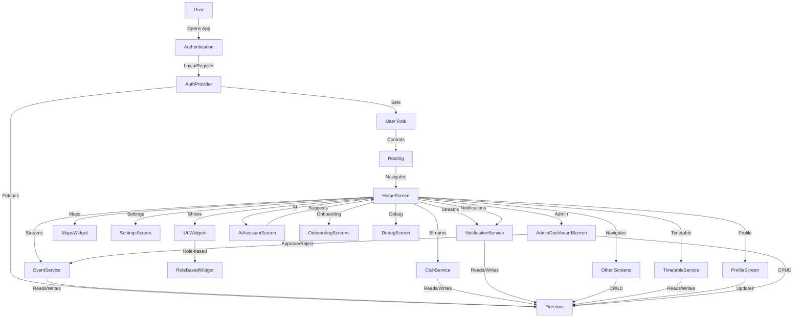
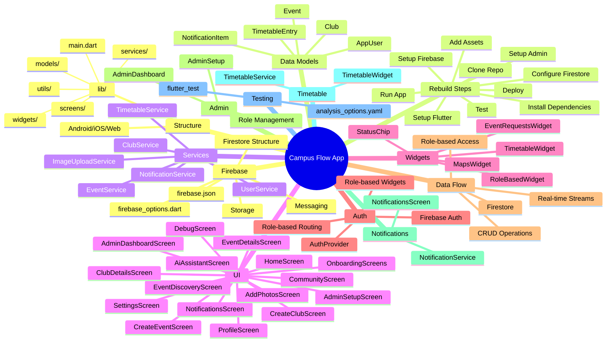

# APP_Documentation

---

## Table of Contents
1. [Project Overview](#project-overview)
2. [Project Structure](#project-structure)
3. [Environment & Dependencies](#environment--dependencies)
4. [Data Models](#data-models)
5. [Services & Data Flow](#services--data-flow)
6. [Authentication & Authorization](#authentication--authorization)
7. [Routing & Navigation](#routing--navigation)
8. [UI Design & Screens](#ui-design--screens)
9. [Widgets & UI Components](#widgets--ui-components)
10. [Admin & Role Management](#admin--role-management)
11. [Notifications](#notifications)
12. [Timetable & Maps](#timetable--maps)
13. [Testing & Linting](#testing--linting)
14. [Firebase Integration](#firebase-integration)
15. [How to Rebuild This Project](#how-to-rebuild-this-project)
16. [Data Flow Diagram](#data-flow-diagram)
17. [Mind Map](#mind-map)

---

## 1. Project Overview

**Campus Flow** is a cross-platform university event management app designed to streamline campus life. It enables:
- **Students** to discover, join, and register for events and clubs.
- **Faculty** to participate and manage academic events.
- **Club Secretaries** to create and manage club events.
- **Admins** to oversee all activities, approve/reject events, and manage users and clubs.

**Key Features:**
- Role-based access and navigation
- Real-time event and club discovery
- Event creation and approval workflow
- Timetable and campus map utilities
- Push notifications and in-app notifications
- Modern, neon/cyberpunk UI theme
- Extensible and maintainable codebase

---

## 2. Project Structure

The project is organized for clarity, scalability, and separation of concerns:

```
campus_flow__/
├── android/           # Native Android project files (Gradle, manifests, etc.)
├── ios/               # Native iOS project files (Xcode, Info.plist, etc.)
├── lib/               # Main Dart/Flutter source code
│   ├── models/        # Data models (AppUser, Club, Event, etc.)
│   ├── services/      # Business logic and data access (Firestore, etc.)
│   ├── widgets/       # Reusable UI components (StatusChip, TimetableWidget, etc.)
│   ├── screens/       # Additional screens (e.g., admin setup)
│   ├── utils/         # Utility functions (e.g., admin setup)
│   ├── main.dart      # App entry point, routing, providers
│   ├── ...            # All feature screens (home, profile, events, etc.)
├── test/              # Widget and unit tests
├── pubspec.yaml       # Flutter dependencies and assets
├── analysis_options.yaml # Linting rules
├── firebase.json      # Firebase configuration
├── README.md          # Project overview
└── ...
```

**Best Practices:**
- Keep business logic in `services/` for testability and separation from UI.
- Use `models/` for all data structures exchanged with Firestore.
- Place all reusable UI in `widgets/` to avoid duplication.
- Use `screens/` for screens that are not part of the main navigation.
- Keep `main.dart` focused on app initialization, providers, and routing.

---

## 3. Environment & Dependencies

### Flutter & Dart
- **Flutter SDK**: ^3.8.1 (ensure compatibility with all plugins)
- **Dart**: As required by Flutter 3.8.1

### Core Dependencies
- **firebase_core**: Initialize Firebase
- **firebase_auth**: User authentication
- **cloud_firestore**: Real-time database
- **firebase_storage**: Media uploads (event/club images)
- **firebase_messaging**: Push notifications
- **go_router**: Declarative, robust navigation
- **provider**: State management
- **uuid**: Generate unique IDs for events, clubs, etc.
- **cupertino_icons**: iOS-style icons

### Dev Dependencies
- **flutter_test**: Widget and unit testing
- **flutter_lints**: Linting and code quality

### Configuration Files
- **pubspec.yaml**: Lists all dependencies, assets, and fonts
- **firebase.json**: Firebase project settings
- **firebase_options.dart**: Platform-specific Firebase config (auto-generated)
- **analysis_options.yaml**: Linting rules

**Example pubspec.yaml excerpt:**
```yaml
  dependencies:
    flutter:
      sdk: flutter
    cupertino_icons: ^1.0.8
    go_router: ^16.0.0
    provider: ^6.1.5
    firebase_core: ^3.15.1
    firebase_auth: ^5.6.2
    cloud_firestore: ^5.6.11
    firebase_storage: ^12.4.9
    firebase_messaging: ^15.2.9
    uuid: ^4.3.3
```

---

## 4. Data Models

All data models are defined in `lib/models/` and are mapped to Firestore documents.

### AppUser
Represents a user in the system.
- **Fields:** id, name, email, photoUrl, phone, bio, role (students, faculty, club_secretaries, admins), clubIds, registeredEventIds, createdAt, updatedAt
- **Usage:** Used for authentication, role-based access, and profile management.

### Club
Represents a student club.
- **Fields:** id, name, description, imageUrl, bannerUrl, category, memberIds, eventIds, createdBy, createdAt, updatedAt
- **Usage:** Used for club discovery, membership, and event association.

### Event
Represents an event organized by a club or admin.
- **Fields:** id, title, description, imageUrl, bannerUrl, location, startTime, endTime, clubId, tags, attendeeIds, capacity, isApproved, createdBy, createdAt, updatedAt
- **Usage:** Used for event discovery, registration, approval workflow, and notifications.

### NotificationItem
Represents a notification sent to users.
- **Fields:** id, type, message, userId, eventId, clubId, timestamp, read
- **Usage:** Used for in-app and push notifications.

### TimetableEntry
Represents a timetable entry for classes or events.
- **Fields:** id, day, timeSlot, subject, room, teacher, description, createdAt, updatedAt
- **Usage:** Used for timetable display and filtering by year, room, or lecture theater.

**Best Practices:**
- Always use strong typing and factory constructors for Firestore mapping.
- Use `toMap()` and `fromFirestore()` for serialization/deserialization.

---

## 5. Services & Data Flow

All business logic and Firestore access is encapsulated in `lib/services/`.

### UserService
- Handles CRUD for users in role-based subcollections (students, faculty, club_secretaries, admins).
- Provides user streams for real-time updates.
- Supports admin creation and user role management.

### EventService
- Handles CRUD for events.
- Provides real-time streams for all events and approved events.
- Used for event creation, approval, and discovery.

### ClubService
- Handles CRUD for clubs.
- Provides real-time streams for club discovery and membership management.

### NotificationService
- Handles CRUD for notifications.
- Provides user-specific notification streams.

### TimetableService
- Handles CRUD for timetable entries.
- Provides streams for timetable by day, year, room, or lecture theater.

### ImageUploadService
- Handles media uploads to Firebase Storage (not detailed here, but used for event/club images).

**Data Flow Example:**
- User logs in → AuthProvider fetches user profile from Firestore → UserService provides user stream → UI updates in real-time.
- Club secretary creates event → EventService writes to Firestore → Admin sees pending event in AdminDashboardScreen → Admin approves event → Event is visible to all users.

**Data Flow Diagram:**



---

## 6. Authentication & Authorization

### Firebase Auth
- Email/password authentication for all users.
- Auth state is managed by `AuthProvider` (ChangeNotifier).
- On login, user profile is fetched from Firestore and role is determined.

### Role Assignment
- **Admins**: Email contains 'admin' or is in the admin collection.
- **Students**: Email matches student pattern (e.g., rollnumber@juetguna.in).
- **Faculty**: Email matches faculty pattern.
- **Club Secretaries**: Email ends with @juetguna.in but not student/faculty/admin.

### AuthProvider
- Listens to Firebase Auth state changes.
- Fetches/creates user profile in Firestore.
- Exposes current user, loading, and error state.
- Provides methods for sign up, sign in, sign out, update profile, change password.

### Role-based Routing
- go_router redirects users based on authentication and role.
- Prevents unauthorized access to admin/club/event creation routes.
- Example: Only admins can access `/admin`, only club secretaries/admins can access `/create-event`.

### Role-based Widgets
- UI elements are shown/hidden based on user role using `RoleBasedWidget`, `AdminOnly`, `ClubSecretaryOrAdmin`, etc.

**Best Practices:**
- Always check user role before showing sensitive UI or performing privileged actions.
- Use provider for global auth state.
- Secure Firestore with role-based security rules (not included here).

---

## 7. Routing & Navigation

### go_router
- Used for declarative, robust navigation.
- Supports deep linking, named routes, and role-based redirects.

### Route Structure
- `/` → AuthGate (redirects based on auth state)
- `/login`, `/register` → Auth screens
- `/home` → HomeScreen (main dashboard)
- `/events` → EventDiscoveryScreen
- `/create-event` → CreateEventScreen (club secretaries/admins)
- `/community` → CommunityScreen
- `/profile` → ProfileScreen
- `/settings` → SettingsScreen
- `/event/:id` → EventDetailsScreen
- `/admin` → AdminDashboardScreen
- `/notifications` → NotificationsScreen
- `/club/:id` → ClubDetailsScreen
- `/search` → SearchScreen
- `/add-photos` → AddPhotosScreen
- `/registration-confirmed` → RegistrationConfirmedScreen
- `/create-club` → CreateClubScreen (admins)
- `/admin-setup` → AdminSetupScreen
- `/debug` → DebugScreen
- Onboarding screens: `/onboarding`, `/onboarding-join-clubs`, `/onboarding-be-the-flow`

### ShellRoute
- Used for main navigation tabs (Home, Events, Community, Profile)
- Floating action button for event creation (club secretaries/admins)

### Role-based Redirects
- Implemented in go_router's `redirect` callback.
- Example: If a student tries to access `/admin`, they are redirected to `/home`.

**Best Practices:**
- Keep all navigation logic in one place (main.dart).
- Use named routes for maintainability.
- Use ShellRoute for tabbed navigation.

---

## 8. UI Design & Screens

### Theme
- Neon/cyberpunk, dark mode, custom color scheme.
- Consistent use of colors, rounded corners, and modern typography.

### Font
- Spline Sans (or default system font).

### Main Screens
- **HomeScreen**: Event discovery, featured carousel, quick actions (role-based), upcoming events.
- **EventDiscoveryScreen**: List of all events, tabs for timetable/maps and event requests (for non-students).
- **EventDetailsScreen**: Event info, status chip, join/share/save actions.
- **CreateEventScreen**: Form for event creation (club secretaries/admins only).
- **CreateClubScreen**: Form for club creation (admins only).
- **CommunityScreen**: List/search/filter clubs, join club, create club (role-based).
- **ClubDetailsScreen**: Club info, members, join button, member list.
- **ProfileScreen**: User info, edit profile, list of clubs/events, change password, admin tools.
- **SettingsScreen**: Preferences (dark mode, notifications), account actions, feedback form.
- **NotificationsScreen**: List of notifications, mark as read (future feature).
- **Onboarding Screens**: Welcome, join clubs, be the flow (multi-step onboarding).
- **AdminDashboardScreen**: Tabs for pending/approved/owned events, approve/reject/reschedule events.
- **AdminSetupScreen**: Create admin user, list admins (for initial setup).
- **AddPhotosScreen**: Placeholder for photo upload (future feature).
- **AiAssistantScreen**: Chat UI, suggestions (future feature).
- **DebugScreen**: Auth/user/debug info for development and troubleshooting.

**UI/UX Best Practices:**
- Use `SafeArea` and `WillPopScope` for navigation and device compatibility.
- Use `Provider` for state management and UI updates.
- Use `StreamBuilder` and `FutureBuilder` for real-time and async data.
- Use custom widgets for consistent UI (StatusChip, TimetableWidget, etc.).

---

## 9. Widgets & UI Components

### StatusChip
- Displays status labels (e.g., Approved, Pending, Rejected) with color coding.
- Used in event and club lists, admin dashboard, etc.

### TimetableWidget
- Interactive timetable by year, lecture theater, or classroom.
- Fetches data from Firestore and displays in a table format.

### MapsWidget
- Placeholder for interactive campus map (future feature).

### EventRequestsWidget
- List and approve/reject event requests (admin/club secretary only).
- Used in admin dashboard and event discovery tabs.

### RoleBasedWidget
- Shows/hides child widgets based on user role.
- Includes convenience widgets: AdminOnly, ClubSecretaryOrAdmin, FacultyOrAdmin.

**Best Practices:**
- Keep widgets stateless where possible.
- Use composition over inheritance for UI reuse.
- Document props and usage for each widget.

---

## 10. Admin & Role Management

### AdminSetupScreen & admin_setup.dart
- Utility to create admin users in Firestore after Firebase Auth registration.
- Used for initial setup and admin onboarding.

### Role-based Access
- Enforced in routing, UI, and services.
- Only admins can create clubs, approve/reject events, and access admin dashboard.
- Club secretaries can create events and manage their own clubs.

### AdminDashboardScreen
- Tabs for pending, approved, and owned events.
- Approve/reject/reschedule events with real-time updates.
- Uses EventService for CRUD operations.

**Best Practices:**
- Always check user role before performing privileged actions.
- Use Firestore security rules to enforce backend access control.

---

## 11. Notifications

### NotificationService
- Firestore-based notifications, user-specific streams.
- Supports event updates, club announcements, reminders, etc.

### NotificationsScreen
- List of notifications for the current user.
- Mark as read (future feature).

### NotificationItem
- Model for notification data (type, message, userId, eventId, clubId, timestamp, read).

**Best Practices:**
- Use push notifications for time-sensitive updates.
- Use in-app notifications for non-urgent messages.
- Store notification read state in Firestore.

---

## 12. Timetable & Maps

### TimetableWidget
- Select by year, lecture theater, or classroom.
- Fetches timetable entries from Firestore.
- Groups and displays entries by day and time slot.

### MapsWidget
- Placeholder for interactive campus map (future feature).
- Designed for extensibility (add Google Maps or custom SVG in future).

**Best Practices:**
- Use real-time streams for timetable updates.
- Allow filtering and searching for better UX.

---

## 13. Testing & Linting

### flutter_test
- For widget and unit tests (see `test/widget_test.dart`).
- Write tests for all business logic in `services/` and UI in `widgets/`.

### analysis_options.yaml
- Uses `flutter_lints` for code quality.
- Customize rules as needed for your team.

**Best Practices:**
- Run `flutter analyze` and `flutter test` before every commit.
- Use CI/CD for automated testing and linting.

---

## 14. Firebase Integration

### firebase_options.dart
- Platform-specific Firebase config (auto-generated by FlutterFire CLI).

### firebase.json
- Firebase project settings (hosting, functions, etc.).

### Firestore Structure
- `users/{role}/{uid}`: User profiles by role
- `clubs/{clubId}`: Club data
- `events/{eventId}`: Event data
- `notifications/{notificationId}`: Notifications
- `timetable/{entryId}`: Timetable entries
- `feedback/{feedbackId}`: User feedback

### Authentication
- Email/password (Firebase Auth)

### Storage
- For event/club images (see `image_upload_service.dart`)

### Messaging
- For push notifications (see `firebase_messaging`)

**Best Practices:**
- Use Firestore security rules for data protection.
- Use indexes for efficient queries.
- Use server timestamps for createdAt/updatedAt fields.

---

## 15. How to Rebuild This Project

1. **Set up Flutter**: Install Flutter SDK 3.8.1+
2. **Clone the repo**: `git clone <repo-url>`
3. **Install dependencies**: `flutter pub get`
4. **Set up Firebase**:
   - Create a Firebase project
   - Add Android/iOS/web apps
   - Download `google-services.json` (Android) and `GoogleService-Info.plist` (iOS)
   - Replace the files in `android/app/` and `ios/Runner/`
   - Update `firebase_options.dart` using FlutterFire CLI
5. **Configure Firestore**: Set up collections as described above
6. **Run the app**: `flutter run`
7. **(Optional) Set up admin user**: Use AdminSetupScreen to create the first admin
8. **(Optional) Add assets/fonts**: As needed for branding
9. **Test**: Run `flutter test`
10. **Deploy**: Build for Android/iOS/web as needed

**Tips:**
- Follow the project structure for maintainability.
- Use the provided data models and services for all data access.
- Use provider and go_router for state management and navigation.
- Customize UI and add features as needed.

---

## 16. Data Flow Diagram

Below is a high-level data flow diagram showing how users, services, screens, and Firestore interact:


---

## 17. Mind Map

Below is a mind map of the app's structure, features, and flows:



---

*This documentation is auto-generated from the source code and is intended to be a complete, actionable reference for rebuilding and understanding the Campus Flow app. For any questions or further clarifications, refer to the codebase or contact the original developers.* 